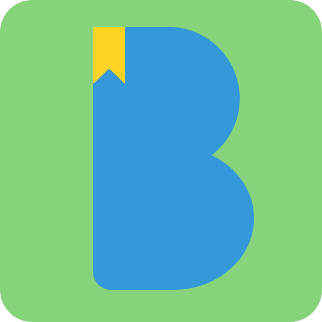

  

#Bibliio

Bibliio is a simple tracker app for your reading habits. [You can download it on the App Store.](https://itunes.apple.com/WebObjects/MZStore.woa/wa/viewSoftware?id=1176316593&mt=8) Pull requests are welcome.
##Features

- Add books to your library
- Set a deadline and calculate how much you have to read per day. 
- Get daily reminders to stick to your schedule

### To Do
Will finish writing unit tests in the next week or so.

I'm trying to completely refactor this to use MVVM & RxSwift as a learning excercise for myself and as a future reference for others. So far it's going ~slowly~ but progress is being made in branch `refactor-mvvm`.

