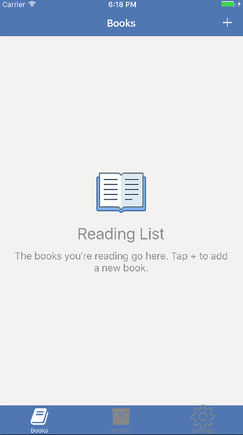
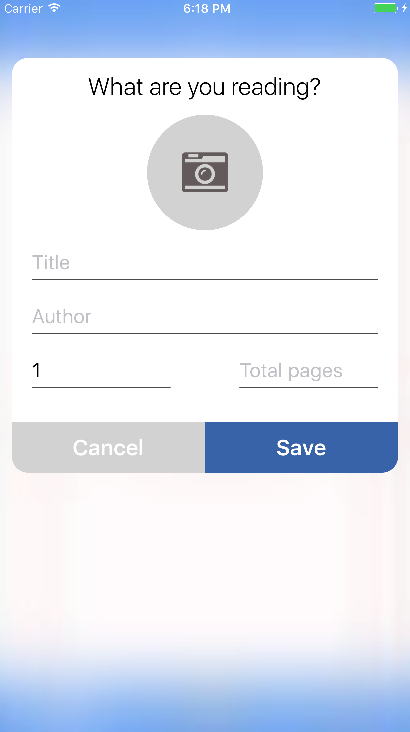
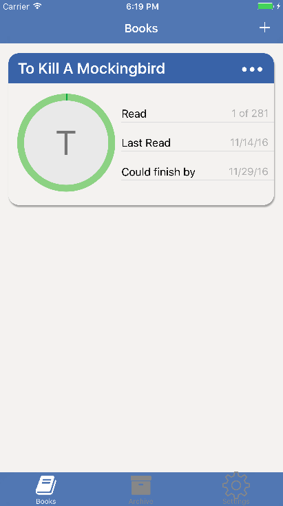
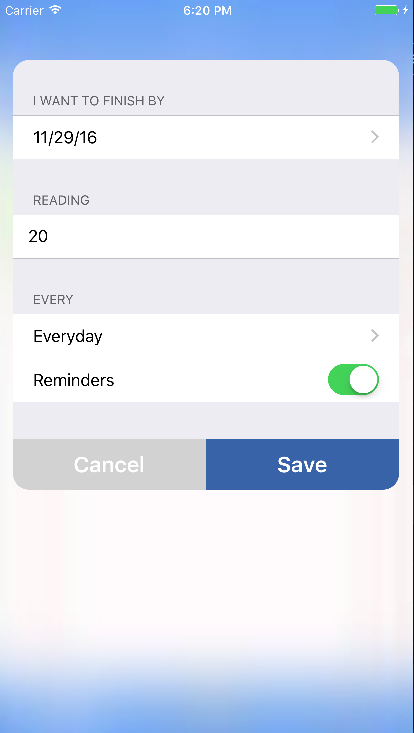

  

#Biblio

Biblio is a simple tracker app for your reading habits. 

##Features

- Add books to your library
- Set a deadline and calculate how much you have to read per day. 
- Get daily reminders to stick to your schedule
- When you're done with a book, it automatically gets added to your archive.

###Screenshots

    
    
    
    

  

### App Store Status

Biblio is still in the submission process. As soon as it's uploaded, this will be updated.

### To Do
This is a project that I'm continually improving. If you're a user that wants to see a feature, create a ticket and I'll definitely take a look. Or if you want to contribute, submit a pull request.

For the next build
- Refactor to an MVVM architecture. View Controllers are bloated with logic and need to be decoupled from model
- Set custom reminders, as of now it defaults to everyday
- Move from archive back into reading list
- Edit book details after having created a book.

Improvements to come eventually
- Bar code scanner for easy input
- Record reading "sessions" -- let the user set a timer and log a reading session. Will generate useful metrics about the user's reading habits
